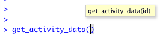
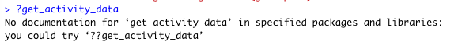
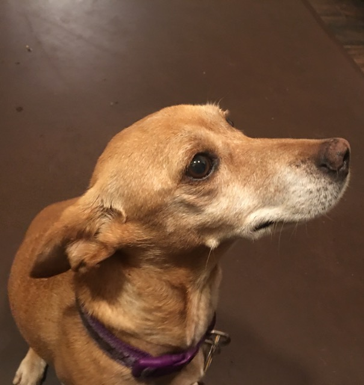
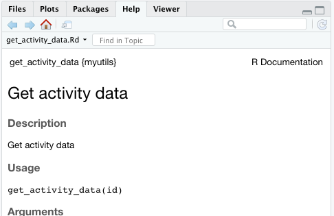

```{r setup, include=FALSE}
knitr::opts_chunk$set(echo = TRUE)
here <- here::here
library(dplyr)
library(purrr)
library(tibble)
library(fs)
```


.boomfull[
<h1>Functions</h1>
]

---

.boomfull[
.hugecode[
```{r eval=FALSE}
plot_prices <- function(data) {
  ggplot(data, aes(x=sqft, y=price)) +
    geom_point() + geom_smooth()
}
```
]
]

---
.boomfull[
<h1>Projects</h1>
]

---

background-image: url("photos/people.jpg")
background-position: center
background-size: contain

---
.boomfull[
<h1>Projects</h1>
]

---
## Glossary

.center[
<h1>Don't repeat yourself</h1>
]
.center[
<h1>Side Effects</h1>
]
.center[
<h1>Clean Code</h1>
]


---
## Glossary - Don't repeat yourself

> Every piece of knowledge must have a single, unambiguous, authoritative representation within a system.

*Maybe* a bit strict for our purposes.

Don't have big copy/paste blocks.

Don't have 4 different "connect_to_database" functions floating around a project.

---
layout: true
## Glossary - Side Effects

---
> Changing state in a way that could change how other code runs.
> 
> `plot()`, `write_csv()`, `Sys.setenv()`, `library()`

```{r eval=FALSE}
pot <- fresh_pot(); cup <- new_cup(cups = 2)
```

---
.pull-left[
```{r eval=FALSE, size="small"}
temp <-
  temperature(pot)

pour(from=pot,
     into=cup,
     cups=2)
```
]

.pull-right[

]

---
.pull-left[
```{r eval=FALSE}
# again!
pour(from=pot,
     into=cup,
     cups=2)
```
]

.pull-right[

]


---
background-image: url("photos/clean_code.jpg")
background-position: center
background-size: contain

---
layout: true
## Glossary - Clean Code

---
.center[
"Clean code can be read, and enhanced by a developer other than its original author."

"You know you are working on clean code when each routine you read turns out to be pretty much what you expected."

Data projects have a lot of verbose code to move, clean, reshape, or enhance the data. It has a tendency to pile up and bury the big picture.

That boilerplate is rarely tested and often copy/pasted.
]


--

.boomfull[
<h1>Reading code is harder than writing it.</h1>
]

---
layout: false
# Options for organizing code

- standalone scripts
- utility scripts (`source("utils.R")`)
- utility package (`devtools::load_all("utils_pkg")`)
- standalone package (`library(package)`)

---
# The Initial Project

Plot all my dog walks, colored by elevation.

.project-equation[
  .project-equation-item[
    ![garmin_logo][garmin_logo]]
  .project-equation-char[x]
  .project-equation-item[
    ![dogpicture][dog_face]]
  .project-equation-char[=]
  .project-equation-item[
    ![dogmap][dogmap_standalone]]
]

[dog_face]: photos/dog_face.jpeg
[dogmap_standalone]: links/0_standalone_scripts/dog_walks.png
[garmin_logo]: https://user-images.githubusercontent.com/6187884/29765129-3d63e67e-8bda-11e7-81c8-7beaf915a02a.jpg

---
class: center, middle

```{r standalone_flow, results="asis", echo=FALSE, fig.align='center', fig.retina=3}
diagram <- DiagrammeR::mermaid("
  graph TD
      setup_keys[setup_keys.R]
      get_downloader[get_downloader.R]
      download_data[download_data.R]
      map_dog_walks[map_dog_walks.R]
      
      class setup_keys,get_downloader,download_data,map_dog_walks script
    
      creds>Stored Garmin Credentials]
      downloader>Python Download Tool]
      fitfiles>Downloaded FIT files]
      dog_walks>Map of walks]
      
      class creds,downloader,fitfiles,dog_walks data
      
      setup_keys --> creds
      get_downloader --> downloader
      creds --> download_data
      download_data --> fitfiles
      downloader --> download_data
      fitfiles --> map_dog_walks
      map_dog_walks --> dog_walks
      
      classDef script fill:#f96,stroke-width:0px
      classDef invisible opacity:1.0
      classDef data stroke-width:0px
")
widgetframe::frameWidget(diagram, width="100%", height="100%")
```

---

```{r include=FALSE}
standalone <- function(..., lines=50) {
  res <- readLines(here(fs::path("0_standalone_scripts",...)))
  if(length(res) > lines) {
    n_more <- length(res)-lines
    res[lines+1] <- paste0("...(",n_more," more lines)...")
    lines <- lines+1
  }
  head(res, lines)
}
```

.pull-left[
**`setup_keys.R`**
.tinycode[
```{r eval=FALSE, code=standalone("setup_keys.R")}
```
]

**`download_data.R`**
.tinycode[
```{r eval=FALSE, code=standalone("download_data.R")}
```
]
]

.pull-right[
**`get_downloader.R`**
.tinycode[
```{r eval=FALSE, code=standalone("get_downloader.R", lines=Inf)}
```
]

**`map_dog_walks.R`**
.tinycode[
```{r eval=FALSE, code=standalone("map_dog_walks.R")}
```
]
]


---
class: center, middle

```{r ref.label='standalone_flow', echo=FALSE, results="asis"}
```

---
# Utility scripts

`.R` files that are `source()`'ed to define functions or variables.

> Note: `config` can handle a lot of configuration needs

```{r eval=FALSE, tidy=FALSE}
library(dplyr)
library(ggplot2)

source("utils_data.R")
source("utils_mapping.R")

get_the_data(date="2019-11-23") %>% #<<
  filter(driver=="Penelope") %>%
  map_all_drives() #<<
```


---
layout: true
## Standalone → Utility scripts

---
Why put things in utility scripts?
  - less code
  - write once for all collaborators
  - separates "define how to do X" from "do X"
    - more readable "do stuff" scripts

---
Do put in utility scripts:
  - Shared configuration (file locations, etc.)
  - Shared needs (DB authentication, loading particular data)
  - Big ugly function definitions

---
Do NOT put in:
  - code that actually takes actions
    - reading data
    - writing data
    - saving plots
    - user interaction
  - `source()` calls to other utility scripts

---
layout: true
## New utility scripts

---
.pull-left[
**`utils/config.R`**
```{r eval=FALSE}
strict_config(value, ...)
```
]
.pull-right[
**`utils/mapping.R`**
```{r eval=FALSE, tidy=T}
get_all_activities()
get_activity_data(id)
flatten_activities(nested)
latlon_bb(df, lat=df$lat,
          lon=df$lon)
pad_bb(bb, lat=1.1,
       lon=lat)
make_basemap(flat_data, zoom=16)
```
]

---
.center[
```{r echo=FALSE, results='asis'}
scriptRows <- function(adir) {
  tibble(path=dir_ls(adir, glob="*.R", recurse=1)) %>%
    transmute(file=basename(path),
           lines=map_int(path, R.utils::countLines))
}
counts <- tribble(
  ~version, ~dir,
  "Standalone", "0_standalone_scripts",
  "Utility", "1_utility_scripts"
) %>%
  mutate(dir = here(dir),
         data = map(dir, scriptRows)) %>%
  tidyr::unnest(data) %>%
  select(version, file, lines) %>%
  tidyr::pivot_wider(file, names_from=version, values_from=lines) %>%
  arrange(desc(Standalone), desc(Utility)) %>%
  set_names(c("","Pre","Post"))

oldopt <- options(knitr.kable.NA = '-')
knitr::kable(counts, format="html")
options(oldopt)
```
]


---
layout:false
```{r utility_flow, results="asis", echo=FALSE, fig.align='center', fig.retina=3}
diagram <- DiagrammeR::mermaid("
  graph TD
      setup_keys[setup_keys.R]
      get_downloader[get_downloader.R]
      download_data[download_data.R]
      map_dog_walks[map_dog_walks.R]
      map_runs[map_runs.R]
      
      class setup_keys,get_downloader,download_data script
      class map_dog_walks,map_runs script
    
      creds>Stored Garmin Credentials]
      downloader>Python Download Tool]
      fitfiles>Downloaded FIT files]
      dog_walks>Map of walks]
      runs>Map of runs]
      
      class creds,downloader,fitfiles,dog_walks,runs data
      
      setup_keys --> creds
      get_downloader --> downloader
      creds --> download_data
      download_data --> fitfiles
      downloader --> download_data
      fitfiles --> map_dog_walks
      map_dog_walks --> dog_walks
      fitfiles --> map_runs
      map_runs --> runs
      
      subgraph utils
        config_utils[config.R]
        mapping_utils[mapping.R]
      end
      
      config_utils -.-> setup_keys
      config_utils -.-> download_data
      config_utils -.-> get_downloader
      config_utils -.-> map_dog_walks
      config_utils -.-> map_runs
      mapping_utils -.-> map_dog_walks
      mapping_utils -.-> map_runs
      
      classDef script fill:#f96,stroke-width:0px
      classDef invisible opacity:1.0
      classDef data stroke-width:0px
")
widgetframe::frameWidget(diagram, width="100%", height="100%")
```

---
background-image: url("photos/kids_win.jpg")
background-position: center
background-size: contain

--
.center[

] 

---
# What did we win?

All configuration in one place

Very easy to add a new mapping script.

RStudio will pop up argument names when you're typing the function.

.center[

]

---
## What's missing?

Function help/documentation

.center[

]


Gets complicated when utility functions need each other
> Mapping scripts only need `utils/config.R` to let `utils/mapping.R` functions find data.

Hard to know what packages the utilities require:
> `utils/config.R` needs `config`
> `utils/mapping.R` needs `ggmap`, `fs`, ...


---
# That sounds familiar...

.pull-left[

]
--
.pull-right[

]

---
# A Package!

Docs/help integrate nicely with RStudio

Namespace lets everything work together

Dependencies are well defined

---

<div style="text-align:center;font-size:250%"><br>BUT</div>
<div style="text-align:center;font-size:175%"><br>Packages are complicated</div>
--
<div style="text-align:center;font-size:150%"><br>and I just have a little code</div>
--
<div style="text-align:center;font-size:125%"><br>just for this one project</div>
--
<div style="text-align:center;font-size:100%"><br>and I don't want to have to install it</div>
--
<div style="text-align:center;font-size:75%"><br>and please don't make me pick a name</div>

---
# The solution

--

.boom[
<h1><code class="remark-inline-code">devtools::load_all()</code></h1>
]

---
# `?devtools::load_all()`

### Load Complete Package.

**`load_all`**
: loads a package. It roughly simulates what happens when a package is installed and loaded with `library()`.

```{r eval=FALSE}
load_all(path = ".", reset = TRUE, recompile = FALSE,
  export_all = TRUE, helpers = TRUE, quiet = FALSE, ...)
```

**`export_all`**
: If `TRUE` (the default), export all objects. If `FALSE`, export only the objects that are listed as exports in the `NAMESPACE` file.

---
### `devtools::load_all()` lets you

.center[
House utility functions alongside "do stuff" code.

Keep a tidy namespace.

Write documentation -- **or not**.

Write tests -- **or not**.

Define dependencies -- **or not**.
]

---
# Utility Scripts → Utility Package

1. Make a package skeleton
    ```{r eval=FALSE, tidy=T}
    usethis::create_package(
      path = "myutils",
      rstudio=FALSE, open=FALSE
      )
    )
    ```
2. Move all your utility scripts in the `R/` folder.
    ```{r eval=FALSE, tidy=T}
    system("mv utils/*.R myutils/R/")
    ```
3. Be done if you feel like it.
    ```{r eval=FALSE, tidy=T}
    pkgload::load_all("myutils")
    ```

---
## Got roxygen2 docs?

.pull-left[
```{r eval=FALSE}
#' Get activity data
#'
#' @param id Garmin Activity ID
#'
#' @return dataframe with one row per moment recorded
#' @export
get_activity_data <- function(id) {
  fit_path <- fs::path(strict_config("gcexport_data_dir"),"fit",paste0("activity_",id,".fit"))
  fit_data <- fit::read.fit(fit_path)
  fit_data$record
}
```
]
.pull-right[
.small[
```{r eval=FALSE}
> devtools::document("myutils")
Updating myutils documentation
Writing NAMESPACE
Loading myutils
Writing NAMESPACE
> devtools::load_all("myutils")
Loading myutils
> ?get_activity_data
Rendering development documentation for 'get_activity_data'
```
]

]


---
## Like tests?

1. Add the boilerplate
```{r eval=FALSE}
setwd("myutils")
usethis::use_testthat()
```
2. Write your tests
```{r eval=FALSE}
usethis::use_test("onething")
# opens tests/testthat/test-onething.R for editing
```
3. Test!
```{r eval=FALSE}
devtools::test(".")
```


---
## Have dependencies?

Usethis will put them in `DESCRIPTION` for you. Same for github packages!
```{r eval=FALSE}
usethis::use_package("ggmap")
devtools::install_github("kuperov/fit")
sethis::use_dev_package("fit")
```
.small[
> add `@import` roxygen tags if you want to use `fun()` instead of `ggmap::fun()` within `myutils`
]

.small[
> `use_dev_package` requires you install the package first so it can find the metadata.
]

Once `DESCRIPTION` is set up, installing all the dependencies is trivial.
```{r eval=FALSE}
devtools::install_deps("myutils")
```


---
## Using your utility package

.pull-left[
```{r eval=FALSE}
source("utils/config.R")
source("utils/mapping.R)
```
]
.pull-right[
```{r eval=FALSE}
devtools::load_all("myutils")
```
]

.small[
> Add to `Depends` in `DESCRIPTION` if you want to skip the `library()` calls
]


---

## What's different from utility scripts?

.pull-left[
<div class="center"><h3>Good</h3></div>
- Functions can work together better
- Documentation
- Tests
- Dependency handling
]

.pull-right[
<div class="center"><h3>Bad</h3></div>
- Bit more work
- Function definitions are harder to find
]

<div class="center"><h3>Same</h3></div>
Project utilities maintained within project repo


---
<h2>
.center[How is this not a regular package?]
</h2>
--
<h2>
.center[*It is a regular package.*]
</h2>

```{r eval=FALSE}
devtools::install("myutils")
library(myutils)
```
--
<h2>
.center[But it's only meant to be used within the project]
</h2>
.small[
Though it's possible to do this:
```{r eval=FALSE}
devtools::install_github(
  "peterfoley/clean_and_dry",
  subdir="2_load_all/myutils")
```
]

---
# Standalone package

All the code is there.

Difference is in how a "standalone" package is **managed**.

  - Users ≠ Developers
  - Likely higher stakes

---
## Utility → Standalone package

1. Define the maintainers
1. Move package to its own git repo
1. `usethis::use_travis()`
1. `usethis::use_coverage()`
1. Expand testing
1. Make docs user-friendly


---
# When the options make sense

.deftable[
.deftable-left[
  Bag-of-scripts
]
.deftable-right[
- Early-stage exploratory work. One-offs.
- While all the scripts are short
- When the scripts aren't duplicative 
]
.deftable-left[
  Utility scripts
]
.deftable-right[
- Dividing/specializing labor
- Multiple similar tasks in scripts
- Utility scripts are few and short
]
.deftable-left[
  Utility package
]
.deftable-right[
- More specialization in labor
- More utilities that call each other
- Higher stakes (= need tests)
]
.deftable-left[
  Standalone package
]
.deftable-right[
- Useful outside the project
]
]


